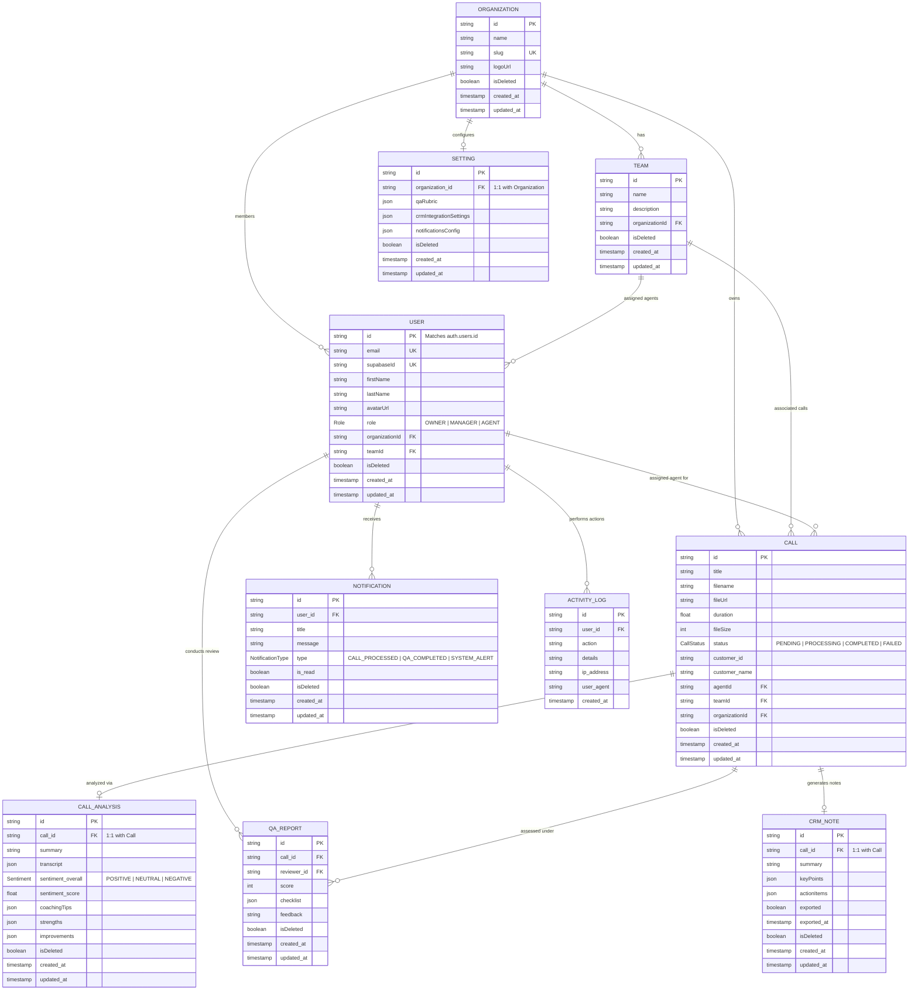

# CallPilot AI Database ER Diagram

This document contains the Entity Relationship Diagram (ERD) of the CallPilot AI database system, visualised using Mermaid.

## Architectural Decisons

1. **Multi-Tenancy:** The database uses an `organizationId` foreign key boundary for all business-critical tables (Users, Teams, Calls, Settings) to prevent data leaks between enterprise accounts.
2. **Soft Delete:** The `isDeleted` boolean is included in active records. A query filter (or Prisma Middleware) is used to exclude deleted records from analytical computations.
3. **Supabase Integration:** The `users.id` primary key matches Supabase's `auth.users.id`. An trigger automatically hooks database insertions into the public schema when a sign-up occurs.
4. **JSON-B Columns:** Complex arrays and nested structures (transcripts, QA compliance checklists, and prompt configurations) are saved in Postgres JSON-B columns to allow schema flexibility for AI analysis.
